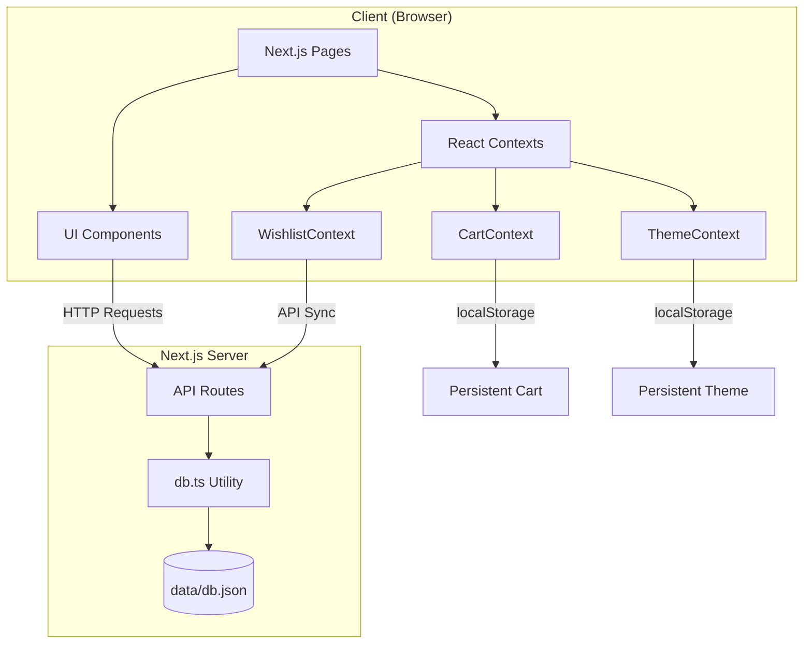
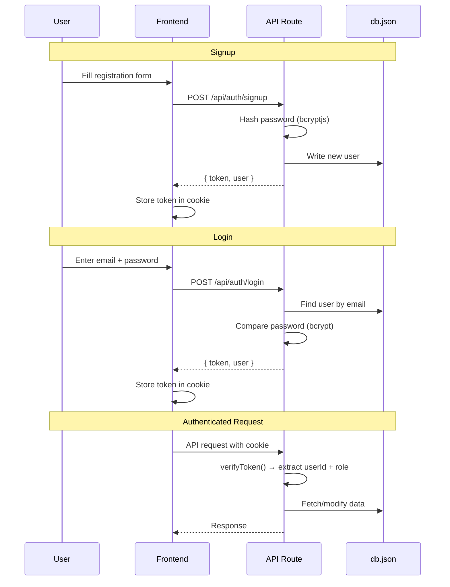
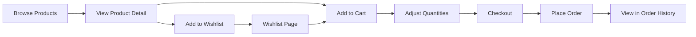
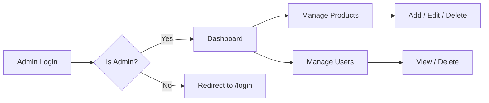
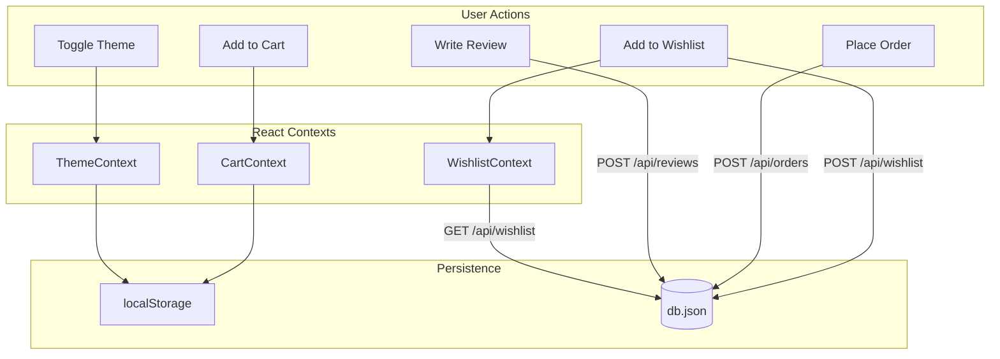
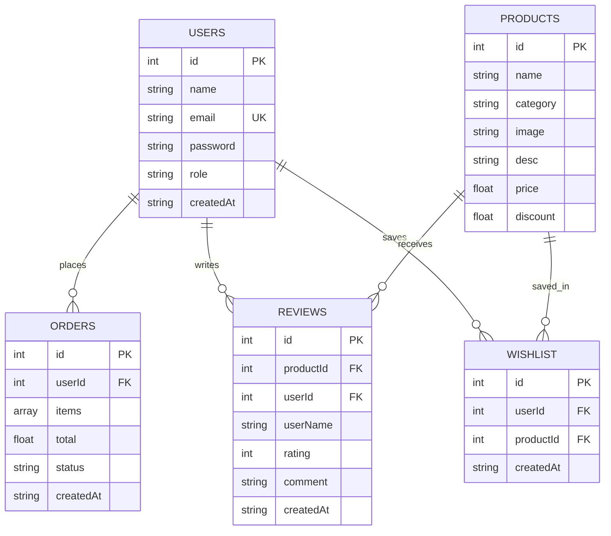

# Hamro Mart

A full-stack e-commerce web application built with **Next.js 15**, **React 19**, **TypeScript**, and **Tailwind CSS**. Features product browsing, cart management, wishlist, user authentication, orders, and an admin dashboard.

---

## Tech Stack

| Layer | Technology |
|-------|-----------|
| Framework | Next.js 15.3.3 (App Router, Turbopack) |
| Language | TypeScript |
| UI | React 19 |
| Styling | Tailwind CSS (Dark Mode, Inter font) |
| State | React Context API (Cart, Theme, Wishlist) |
| Icons | Heroicons, React Icons |
| Notifications | React Hot Toast |
| Auth | Cookie-based (js-cookie) + bcryptjs |
| Database | Local JSON file (`data/db.json`) |

---

## High-Level Architecture



---

## Project Structure

```
hamro-mart/
├── data/
│   └── db.json                    # JSON database (products, users, orders, reviews, wishlist)
├── scripts/
│   └── seed.ts                    # Database seed script (bcrypt password hashing)
├── src/
│   ├── app/                       # Next.js App Router
│   │   ├── layout.tsx             # Root layout (Inter font, providers, toaster)
│   │   ├── page.tsx               # Homepage
│   │   ├── not-found.tsx          # Custom 404 page
│   │   ├── globals.css            # Design system (@layer base/components/utilities)
│   │   ├── login/page.tsx         # User login
│   │   ├── register/page.tsx      # User registration
│   │   ├── profile/page.tsx       # User profile
│   │   ├── products/
│   │   │   ├── page.tsx           # Product listing (search, filter, sort)
│   │   │   └── [id]/page.tsx      # Product detail + reviews
│   │   ├── cart/page.tsx          # Shopping cart
│   │   ├── checkout/page.tsx      # Checkout & order placement
│   │   ├── wishlist/page.tsx      # Saved items
│   │   ├── orders/page.tsx        # Order history
│   │   ├── admin/
│   │   │   ├── layout.tsx         # Admin sidebar layout
│   │   │   ├── page.tsx           # Admin dashboard
│   │   │   ├── products/page.tsx  # Product management (CRUD)
│   │   │   └── users/page.tsx     # User management
│   │   └── api/                   # API Routes
│   │       ├── auth/login/route.ts
│   │       ├── auth/signup/route.ts
│   │       ├── products/route.ts
│   │       ├── products/[id]/route.ts
│   │       ├── users/route.ts
│   │       ├── users/[id]/route.ts
│   │       ├── wishlist/route.ts
│   │       ├── wishlist/[id]/route.ts
│   │       ├── orders/route.ts
│   │       ├── reviews/route.ts
│   │       └── categories/route.ts
│   ├── context/                   # React Contexts
│   │   ├── CartContext.tsx         # Cart state + localStorage
│   │   ├── WishlistContext.tsx     # Wishlist state + API sync
│   │   └── ThemeContext.tsx        # Dark/light mode toggle
│   ├── lib/
│   │   └── db.ts                  # readDB/writeDB + token helpers
│   ├── _components/               # Reusable UI
│   │   ├── Navbar.tsx             # Auth-aware nav + mobile drawer
│   │   ├── Img.tsx                # App download section
│   │   └── home/
│   │       ├── Hero.tsx           # Hero banner + feature bar
│   │       ├── Categories.tsx     # Category links
│   │       ├── AD.tsx             # Promo section
│   │       └── Footer.tsx         # Newsletter + links
│   └── _pages/                    # Page-level components
│       ├── Home.tsx               # Homepage composition
│       └── Products.tsx           # Product grid with filters
├── tailwind.config.js
├── next.config.ts
├── tsconfig.json
└── package.json
```

---

## Authentication Flow



**Token format:** `{base64Payload}.{base64Signature}`  
Payload contains `{ id, role, email, name }`.

---

## User Workflows

### Shopping Flow



### Admin Flow



---

## Data Flow



| Data | Storage | Sync |
|------|---------|------|
| Cart | localStorage via CartContext | Client-side only |
| Wishlist | db.json via WishlistContext | API sync on add/remove |
| Theme | localStorage via ThemeContext | Client-side only |
| Orders | db.json via API | Written on checkout |
| Reviews | db.json via API | Written on submit |
| Users | db.json via API | Written on signup |

---

## Pages

| Route | Description |
|-------|-------------|
| `/` | Homepage with hero, categories, promo cards, footer |
| `/products` | Product listing with search, category filter, price sorting |
| `/products/[id]` | Product detail with quantity selector, reviews, related products |
| `/cart` | Shopping cart with quantity controls and line totals |
| `/checkout` | Order summary and placement |
| `/wishlist` | Saved products for later |
| `/orders` | Order history with status badges |
| `/profile` | User profile with order/wishlist counts |
| `/login` | User login with show/hide password |
| `/register` | User registration with validation |
| `/admin` | Admin dashboard with statistics |
| `/admin/products` | Admin product management (add/edit/delete) |
| `/admin/users` | Admin user management (view/delete) |

---

## API Routes

| Method | Endpoint | Description |
|--------|----------|-------------|
| POST | `/api/auth/login` | Login with email/password |
| POST | `/api/auth/signup` | Register new user |
| GET | `/api/products` | Fetch all products |
| POST | `/api/products` | Create product (admin) |
| GET | `/api/products/:id` | Fetch product by ID |
| PUT | `/api/products/:id` | Update product (admin) |
| DELETE | `/api/products/:id` | Delete product (admin) |
| GET | `/api/users` | Fetch all users (no passwords) |
| PUT | `/api/users/:id` | Update user (admin) |
| DELETE | `/api/users/:id` | Delete user (admin) |
| GET | `/api/wishlist?userId=X` | Get user wishlist |
| POST | `/api/wishlist` | Add to wishlist |
| DELETE | `/api/wishlist/:id` | Remove from wishlist |
| GET | `/api/orders?userId=X` | Get user orders |
| POST | `/api/orders` | Create new order |
| GET | `/api/reviews?productId=X` | Get product reviews |
| POST | `/api/reviews` | Submit a review |
| GET | `/api/categories` | Get all categories |

---

## Database Schema



---

## UI Design System

| Element | Classes |
|---------|---------|
| Primary Button | `btn-primary` (emerald-600, white text, hover emerald-700) |
| Secondary Button | `btn-secondary` (gray border, dark mode compatible) |
| Danger Button | `btn-danger` (red-600) |
| Card | `card` (white bg, rounded-2xl, shadow, border) |
| Input | `input-field` (rounded-xl, border, focus ring) |
| Badge | `badge` (inline-flex, rounded-full, padding) |
| Page Container | `page-container` (max-w-7xl, centered, padded) |

**Brand colors:** Emerald (primary), Gray (neutral), full dark mode support.

---

## Getting Started

### Prerequisites

- Node.js 18+
- npm or yarn

### Install & Run

```bash
# Clone the repository
git clone git@github.com:Sushantmg/hamro-mart.git
cd hamro-mart

# Install dependencies
npm install

# Seed the database (optional — creates hashed passwords)
npx tsx scripts/seed.ts

# Start development server
npm run dev
```

Open [http://localhost:3000](http://localhost:3000) in your browser.

### Available Scripts

| Command | Description |
|---------|-------------|
| `npm run dev` | Start dev server with Turbopack |
| `npm run build` | Production build |
| `npm start` | Start production server |
| `npm run lint` | Run ESLint |
| `npx tsx scripts/seed.ts` | Seed database with hashed passwords |

---

## Test Credentials

| Email | Password | Role |
|-------|----------|------|
| admin@hamromart.com | admin123 | admin |
| sus@gmail.com | 1234 | user |
| testuser1@example.com | pass123 | user |
| alice@example.com | alice123 | user |
| bob@example.com | bobsecure | user |
| charlie@example.com | charlie456 | user |
| diana@example.com | diana789 | user |
